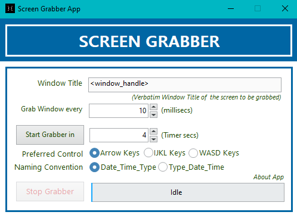

# Getting started
Install the LabVIEW2018 run time engine from the ni repo [link](https://www.ni.com/en-in/support/downloads/software-products/download.labview.html) with appropriate system bit config. Run the Screen Grabber executable inside /Builds/Screen Grabber Exe

The pre-built executable available in the repo was built and tested for the windows ecosystem (7/8/10). You should see an intro screen similar to shown below after launching the app.

