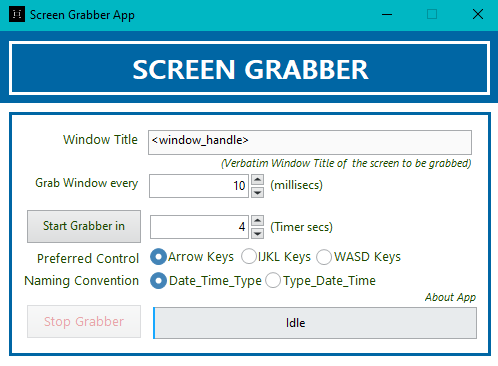

# lv-screen-grabber-app
App to capture any windows desktop app's screen & keyed inputs (at set intervals) using user32 DLLs. Originally created for data collection pipeline of the Assetto Corsa simulation environment. Written in LabVIEW2018.

